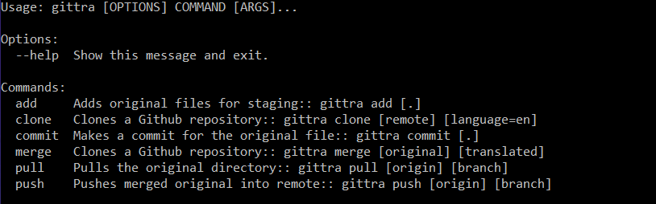
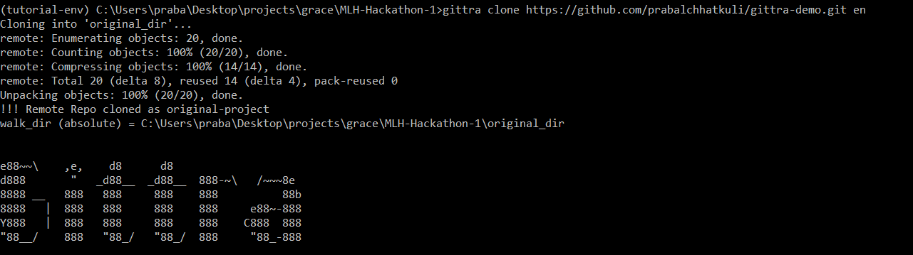
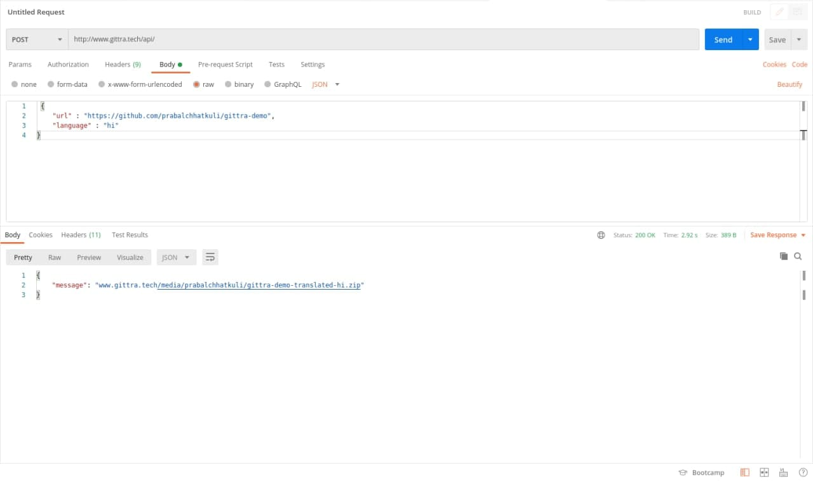
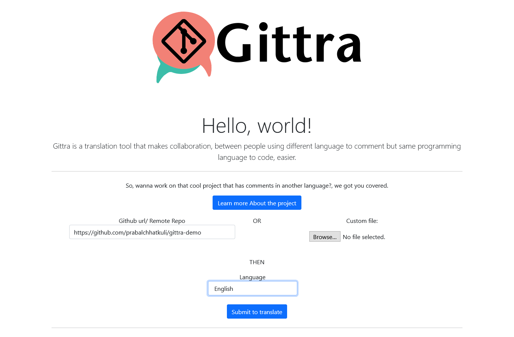
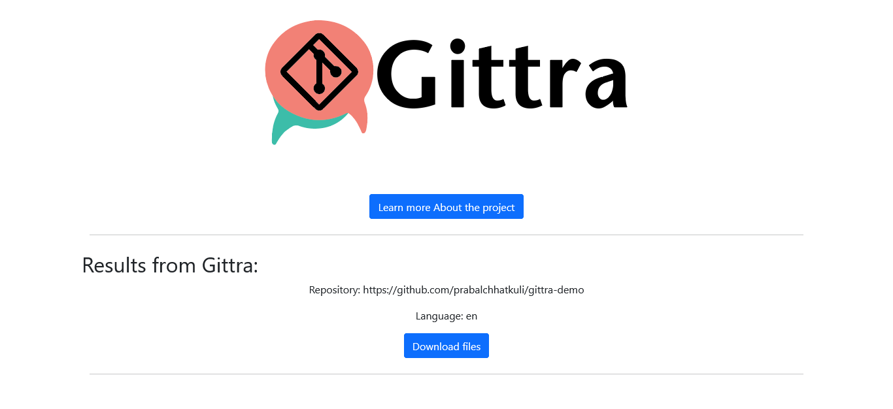

[](https://badges.pufler.dev)

[](https://forthebadge.com)
[](https://forthebadge.com) 
[](https://forthebadge.com) 
[](https://forthebadge.com) 
[](https://forthebadge.com)

<p align="center">
  <a href="www.gittra.com">
    
  </a>

  <h3 align="center">GitTra</h3>

  <p align="center">
    Git add-on for translating comments on open-source project. 
    <br />
    Helps people work on inter-language collaboration.
  </p>
</p>


## Table of Contents

* [About the Project](#about-the-project)
  * [Built With](#built-with)
* [Getting Started](#getting-started)
  * [Prerequisites](#prerequisites)
  * [Installation](#installing-the-cli-client)
  * [Usage](#usage-commands)
* [Web Application](#web-application)
    * [Django](#django)
    * [Installation](#django-installation)
    * [Features](#features)
* [Screenshots](#screenshots)
* [Authors](#authors)
* [Contributing](#contributing)
* [License](#license)

## About the Project
[GitTra](https://www.gittra.com/) is a translation tool for open source collaborator. 

Got that one project that you want to work on and all the documentation is in chinese?
   ... we got you covered.

Use Gittra as a CLI or use our Dashboard to clone a translated version.
All you need is a remote repo name, and you're good to go.

### Built With
*   Python
*   Django
*   Google Translator

[Back to Table of Contents](#table-of-contents)

## Getting Started

### Prerequisites
- Ensure that you have the Github CLI client installed. If not, follow the instructions [here](https://github.com/cli/cli) to set it up.
- Ensure that you have pip and python installed.
- Optional: Set up a virtual environment by following the instructions [here](https://docs.python.org/3/library/venv.html)
- Install the required dependencies using `pip install -r requirements.txt`

### Installing the CLI client
- In the root directory, run the following command:
  - **Linux**: `python3 -m pip install --editable .`
  - **Windows & Mac**: `pip install -e .`
- Use any `gittra` command now to fork, clone and push repos in different languages!

### Usage Commands
- `gittra fork [GITHUB URL] [LANGUAGE]` Forks a Github repository and translates comments into a given language on a new 'translated' branch
- `gittra clone [GITHUB URL] [LANGUAGE]` Clones a Github repository and translates comments into a given language on a new 'translated' branch
- `gittra push` Pushes into the 'translated' branch of the respository and automatically updates the 'main' branch as well


## Web Application

## Frontend

* #### Django template language
    Django’s template language is designed to strike a balance between power and ease. It’s designed to feel comfortable to those used to working with HTML. If you have any exposure to other text-based template languages, such as Smarty or Jinja2, you should feel right at home with Django’s templates.
    

## Backend

* #### Django 
    Django is a high-level Python Web framework that encourages rapid development and clean, pragmatic design. Built by experienced developers, it takes care of much of the hassle of Web development, so you can focus on writing your app without needing to reinvent the wheel. It's free and open source.
    
    * ###### Why Django ?
        *  Ridiculously fast
        *  Reassuringly secure
        *  Exceedingly scalable
        *  Incredibly versatile
        *  Easy to Integrate with Python Libraries/Functions
  
### Django Installation

* Backend

    ```Python
    pip install -r requirements.txt
    python manage.py makemigrations
    python manage.py migrate
    ```

### Usage

* To Create Super User

    ``` python
    python3 manage.py createsuperuser
    ```
    
    
* To Run Server

    ``` python
    python3 manage.py runserver
    ```
    
[Back to Table of Contents](#table-of-contents)


## Features
  * Translate the repository using the GitHub repo URL, uploading a zip file.
  * Translate the repository by replacing GitHub.com with GitTra.com
  * Send a Post request to /api and will receive the Translated Zip URL in response.

[Back to Table of Contents](#table-of-contents)

## Screenshots












## Authors
<table>
  <tr>
    <td align="center">
        <a href="https://github.com/prabalchhatkuli">
            <br />
        </a>
        <br><a href="https://github.com/saksham1991999/GitTra/commits?author=prabalchhatkuli" title="Code">💻<b>Prabal Chhatkuli</b></a>
    </td>    
    <td align="center">
        <a href="https://github.com/saksham19919999/">
            <br />
        </a>
            <br><a href="https://github.com/saksham1991999/GitTra/commits?author=saksham1991999" title="Code">💻<b>Saksham Mittal</b></a>
    </td>
   <td align="center">
        <a href="https://github.com/gracewgao/">
            <br />
        </a>
            <br><a href="https://github.com/saksham1991999/GitTra/commits?author=gracewgao" title="Code">💻<b>Grace Gao</b></a>
    </td>
  </tr>
</table>


[Back to Table of Contents](#table-of-contents)

## Contributing
Pull requests are welcome. For major changes, please open an issue first to discuss what you would like to change.

Please make sure to update tests as appropriate.

## License
[MIT](https://choosealicense.com/licenses/mit/)

[Back to Table of Contents](#table-of-contents)